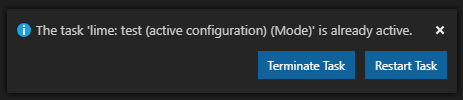
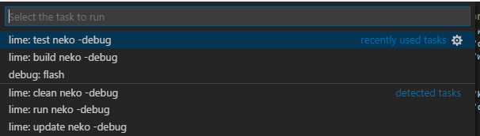

# Terminator
[](https://travis-ci.org/vshaxe/vscode-terminator) [](https://marketplace.visualstudio.com/items?itemName=vshaxe.terminator) [](https://marketplace.visualstudio.com/items?itemName=vshaxe.terminator)

Have you wasted countless clicks on this popup too?



No more! Terminator allows you to run tasks without any mercy for any potentially still running predecessor. Just add something like this to your `keybindings.json`:

```json
{
	"key": "ctrl+shift+b",
	"command": "terminator.run",
	"args": ["^test \\(active configuration\\)"]
}
```

`args` contains a regex that matches against the task name, in this case the `test (active configuration)` task (extension prefixes like `lime:` are _not_ part of the string that is matched against).



If you're using the [Lime extension](https://marketplace.visualstudio.com/items?itemName=openfl.lime-vscode-extension), you may also want to add the following `when` condition to your keybinding:

```js
{
	// ...
	"when": "haxeCompletionProvider == 'Lime'"
}
```
______

>John Connor: You just can't go around killing tasks.
>
>The Terminator: Why?
>
>John Connor: What do you mean why? 'Cause you can't.
>
>The Terminator: Why?
>
>John Connor: Because you just can't, okay? Trust me on this.